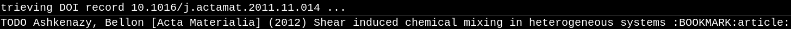

# Table of Contents

1.  [Extracting metadata (including BiBTeX) from websites to be used by Org mode capture](#orga62e082)
    1.  [Installation](#orga969e91)
        1.  [Using straight.el](#orgc60c302)
        2.  [Using quelpa](#org8888a2a)
        3.  [Using direct download](#org4cdfc4e)
    2.  [Usage](#orga692933)
        1.  [Capture setup](#org8340c1a)
        2.  [Capturing links from browser](#org95ecd98)
        3.  [Capturing rss links from elfeed](#org49dc9ac)
    3.  [Extra features](#org3556c30)
        1.  [Detecting existing captures](#org1c92667)
        2.  [Integration with qutebrowser](#qute_integration)
    4.  [Customisation](#orgf9ed349)
        1.  [Retrieving BiBTeX / metadata fields](#org819faa2)
        2.  [Key generation](#org3eaecd6)
        3.  [Formatting BiBTeX entry](#org851f0a5)
        4.  [Validating the BiBTeX entry](#orgf30bfb2)
    5.  [Planned features](#orgcada4bc)

# Extracting metadata (including BiBTeX) from websites to be used by Org mode capture

This package is inspired by [org-ref](https://github.com/jkitchin/org-ref), extending org-ref's idea to auto-retrieve BiBTeX from scientific paper links. Instead of limiting BiBTeX generation to research purposes (scientific articles and books), this package auto-generates BiBTeX for any possible web link (Youtube videos, blog posts, reddit threads, etc).

More precisely, relevant metadata, like author, title, publisher, publication date, etc, is extracted from an arbitrary web link. The metadata can be transformed into a BiBTeX entry or used directly in Org mode capture template.

Unlike `org-ref`, this package is designed to be used together with [org-capture](https://orgmode.org/manual/Capture.html#Capture). The package is created assuming that the links/articles/books are captured from web sources using the following methods:

-   [org-protocol](https://orgmode.org/manual/The-capture-protocol.html#The-capture-protocol) from system browser
-   org-protocol from [elfeed](https://github.com/skeeto/elfeed/)

The generated BiBTeX for web links can be directly inserted into a `.bib` file and handled by org-ref just like any other book/paper.
Alternatively (recommended), the metadata can be kept in org-mode entries as the main bibliography source (and tangled into the .bib file if needed). An example of such setup can be found in [this blog post](http://cachestocaches.com/2020/3/org-mode-annotated-bibliography/).

The package also tries to make sure that no duplicate links are captured. If a duplicate is found, there is an option to display the location of the duplicate. The duplicate can also be updated according to the newly extracted metadata. For example, a research publication published online does not initially contain the journal volume number. The captured online publication can be later update as the publication page is updated.

Below are examples of captured web links. The links are captured as todo-entries in org-mode with BiBTeX stored and code block within the entry.

Github page with BiBTeX

Github page with metadata

Reddit post

Scientific article

## Installation

The package is currently not on Melpa/Elpa now. It is possible to install package directly downloading the `.el` files from Github or using package managers with git support:

### Using [straight.el](https://github.com/raxod502/straight.el/)

    (straight-use-package '(org-capture-ref :type git :host github :repo "yantar92/org-capture-ref"))

or with [use-package](https://github.com/jwiegley/use-package/)

    (use-package org-capture-ref
      :straight (org-capture-ref :type git :host github :repo "yantar92/org-capture-ref"))

### Using [quelpa](https://github.com/quelpa/quelpa)

    (quelpa '(org-capture-ref :repo "yantar92/org-capture-ref" :fetcher github))

### Using direct download

1.  Download `org-capture-ref.el` from this page and save it somewhere in Emacs [load-path](https://www.gnu.org/software/emacs/manual/html_node/emacs/Lisp-Libraries.html#Lisp-Libraries)
2.  Open the file in Emacs
3.  Run `M-x package-install-from-buffer <RET>`
4.  Put `(require 'org-capture-ref)` somewhere in your init file

## Usage

### Capture setup

Below is example configuration defining org capture template using org-capture-ref, [asoc.el](https://github.com/troyp/asoc.el), [s.el](https://github.com/magnars/s.el) and [doct](https://github.com/progfolio/doct). You will need to install these packages to make the example work:

1.  Using [straight.el](https://github.com/raxod502/straight.el/)
    
        (straight-use-package '(asoc.el :type git :host github :repo "troyp/asoc.el"))
        (straight-use-package s)
        (straight-use-package doct)

2.  Using [straight.el](https://github.com/raxod502/straight.el/) with [use-package](https://github.com/jwiegley/use-package/)
    
        (use-package asoc
            :straight (asoc.el :type git :host github :repo "troyp/asoc.el"))
        (use-package s
          :straight t)
        (use-package doct
          :straight t)

3.  Using [quelpa](https://github.com/quelpa/quelpa)
    
        (quelpa '(asoc.el :repo "troyp/asoc.el" :fetcher github))
        (quelpa 's)
        (quelpa 'doct)

4.  Using direct download

Follow instructions from [Using direct download](#org4cdfc4e). The packages can be downloaded from the following websites:

-   <https://github.com/troyp/asoc.el>
-   <https://github.com/magnars/s.el>
-   <https://github.com/progfolio/doct/>

The example will define two new capture templates:

-   **Silent link (B):** create a new TODO entry in `~/Org/inbox.org` containing author, journal/website, year, and title of the web-page + the generated BiBTeX (see examples above);
-   **Interactive link (b):** interactive version of the above. It opens Emacs frame allowing to modify the link before confirming the capture.

These capture templates can later be called from inside Emacs or from browser (using [org-protocol](https://orgmode.org/manual/The-capture-protocol.html#The-capture-protocol)).

    (require 'org-capture)
    (require 'asoc)
    (require 'doct)
    (require 'org-capture-ref)
    (let ((templates (doct '( :group "Browser link"
     			  :type entry
     			  :file "~/Org/inbox.org"
     			  :fetch-bibtex (lambda () (org-capture-ref-process-capture)) ; this must run first
                              :link-type (lambda () (org-capture-ref-get-bibtex-field :type))
                              :extra (lambda () (if (org-capture-ref-get-bibtex-field :journal)
    					   (s-join "\n"
                                                       '("- [ ] download and attach pdf"
    						     "- [ ] [[elisp:org-attach-open][read paper capturing interesting references]]"
    						     "- [ ] [[elisp:(browse-url (url-encode-url (format \"https://www.semanticscholar.org/search?q=%s\" (org-entry-get nil \"TITLE\"))))][check citing articles]]"
    						     "- [ ] [[elisp:(browse-url (url-encode-url (format \"https://www.connectedpapers.com/search?q=%s\" (org-entry-get nil \"TITLE\"))))][check related articles]]"
                                                         "- [ ] check if bibtex entry has missing fields"))
                                             ""))
                              :org-entry (lambda () (org-capture-ref-get-org-entry))
    			  :template
                              ("%{fetch-bibtex}* TODO %?%{space}%{org-entry}"
                               "%{extra}"
                               "- Keywords: #%{link-type}")
    			  :children (("Interactive link"
    				      :keys "b"
    				      :clock-in t
                                          :space " "
    				      :clock-resume t
    				      )
    				     ("Silent link"
    				      :keys "B"
                                          :space ""
    				      :immediate-finish t))))))
      (dolist (template templates)
        (asoc-put! org-capture-templates
    	       (car template)
    	       (cdr  template)
    	       'replace)))

**TL;DR how the above code works**: Call `org-capture-ref-process-capture` at the beginning to scrape BiBTeX from the link. Then use `org-capture-ref-get-org-entry` to format the heading (according to `org-capture-ref-headline-format`). Alternatively it is possible to use `org-capture-ref-get-bibtex-field` to get metadata directly (`:bibtex-string` field will contain formatted BiBTeX entry).

### Capturing links from browser

The above capture templates can be used via  [org-protocol](https://orgmode.org/manual/The-capture-protocol.html#The-capture-protocol):

-   For popular browsers like Firefox, see [Alphapapa's org-protocol instructions](https://github.com/alphapapa/org-protocol-capture-html#org-protocol-instructions)
-   For Qutebrowser, see [Integration with qutebrowser](#qute_integration) section below.

### Capturing rss links from [elfeed](https://github.com/skeeto/elfeed/)

Example configuration for capturing `elfeed` entries (assuming the capture template above). `Elfeed` entry object is passed to org-capture-ref via `:elfeed-data`.

    (defun yant/elfeed-capture-entry ()
      "Capture selected entries into inbox."
      (interactive)
      (elfeed-search-tag-all 'opened)
      (previous-logical-line)
      (let ((entries (elfeed-search-selected)))
        (cl-loop for entry in entries
    	     do (elfeed-untag entry 'unread)
    	     when (elfeed-entry-link entry)
    	     do (flet ((raise-frame nil nil))
    		  (org-protocol-capture (list :template "B"
    					      :url it
    					      :title (format "%s: %s"
    							     (elfeed-feed-title (elfeed-entry-feed entry))
    							     (elfeed-entry-title entry))
                                                  :elfeed-data entry))))
        (mapc #'elfeed-search-update-entry entries)
        (unless (use-region-p) (forward-line))))

The above function should be ran (`M-x yant/elfeed-capture-entry <RET>`) with point at an `elfeed` entry.

## Extra features

### Detecting existing captures

Org-capture-ref checks if there are any existing headlines containing the captured link already. By default, :ID: {cite key of the BiBTeX}, :Source: {URL}, :URL: {URL} properties, and article title for journal publications  are checked in all files searchable by `org-search-view`.

If org-capture-ref finds that the captured link already exist in org files the matching entry is shown by default unless capture template has `:immediate-finish t`. The is the queried to update the existing entry according to the current metadata. If the user agrees, normal Org capture buffer will be displayed and the captured heading will be interactively merged with the existing link capture.

### Integration with [qutebrowser](https://github.com/qutebrowser/qutebrowser/)

The web-page contents loaded in qutebrowser can be reused by org-capture-ref without a need to load the page again for parsing. This also means that content requiring authorisation can be parsed by the package.

If one wants to use this feature, extra argument `html` will need to be provided to org-protocol from qutebrowser userscript.

In addition, package logs can be shown as qutebrowser messages if `qutebrowser-fifo` is provided.

An example of bookmarking userscript is below:

    rawurlencode() {
        local string="${1}"
        local strlen=${#string}
        local encoded=""
        local pos c o
    
        for (( pos=0 ; pos<strlen ; pos++ )); do
    	c=${string:$pos:1}
    	case "$c" in
                [-_.~a-zA-Zа-яА-Я0-9] ) o="${c}" ;;
    	    [\[\]] ) o="|" ;;
    	    * )               printf -v o '%%%02x' "'$c"
    	esac
    	encoded+="${o}"
        done
        echo "${encoded}"    # You can either set a return variable (FASTER) 
        REPLY="${encoded}"   #+or echo the result (EASIER)... or both... :p
    }
    
    # Returns a string in which the sequences with percent (%) signs followed by
    # two hex digits have been replaced with literal characters.
    rawurldecode() {
    
        # This is perhaps a risky gambit, but since all escape characters must be
        # encoded, we can replace %NN with \xNN and pass the lot to printf -b, which
        # will decode hex for us
    
        printf -v REPLY '%b' "${1//%/\\x}" # You can either set a return variable (FASTER)
    
        #  echo "${REPLY}"  #+or echo the result (EASIER)... or both... :p
    }
    
    
    # Initialize all the option variables.
    # This ensures we are not contaminated by variables from the environment.
    TEMPLATE="b"
    FORCE=""
    
    while :; do
        case $1 in
    	--force)       # Takes an option argument; ensure it has been specified.
    	    FORCE="t"
    	    shift
                ;;
            --silent)
    	    TEMPLATE="B"
                shift
                ;;
            --rss)
                TEMPLATE="r"
                shift
                ;;
            *)
                break
        esac
        shift 
    done 
    
    rawurlencode "$QUTE_URL"
    URL="$REPLY"
    
    TITLE="$(echo $QUTE_TITLE | sed -r 's/&//g')"
    
    SELECTED_TEXT="$QUTE_SELECTED_TEXT"
    
    (emacsclient "org-protocol://capture?template=$TEMPLATE&url=$URL&title=$TITLE&body=$SELECTED_TEXT&html=$QUTE_HTML&qutebrowser-fifo=$QUTE_FIFO"\
         && echo "message-info '$(cat ~/Org/inbox.org | grep \* | tail -n1)'" >> "$QUTE_FIFO" || echo "message-error \"Bookmark not saved!\"" >> "$QUTE_FIFO");

## Customisation

The main function used in the package is `org-capture-ref-process-capture`. It takes the capture info from org-protocol, loads the link html (by default), and parses it to obtain and verify the BiBTeX. The parsing is done in the following steps:

1.  The capture info is scraped to get the necessary BiBTeX fields according to `org-capture-ref-get-bibtex-functions`
2.  Unique BiBTeX key is generated according to `org-capture-ref-generate-key-functions`
3.  The obtained BiBTeX fields and the key are used to format (`org-capture-ref-get-formatted-bibtex-functions`) and cleanup (`org-capture-ref-clean-bibtex-hook`) BiBTeX entry
4.  The generated entry is verified (by default, it is checked if the link is already present in org files) according to `org-capture-ref-check-bibtex-functions`

### Retrieving BiBTeX / metadata fields

When capture is done from `elfeed`, org-capture-ref first attempts to use the feed entry metadata to obtain all the necessary information. Otherwise, the BiBTeX information is retrieved by scraping the web-page (downloading it when necessary according to `org-capture-ref-get-buffer-functions`).

The necessary BiBTeX fields are the fields defined in `org-capture-ref-field-regexps`, though individual website parsers may add extra fields. For example, `elfeed` entries often contain keywords information.

Any captured link is assigned with `howpublished` field, which is simply web-site name without front `www` part and the tail `.com/org/...` part.

By default, the BiBTeX entry has `@misc` type (see `org-capture-ref-default-type`).

If capture information or website contains a DOI, <https://doi.org> is used to obtain the BiBTeX.
If capture information or website contains a ISBN, <https://ottobib.com> is used to obtain the BiBTeX.

Parsers for the following websites are available:

-   Scientific articles from APS, Springer, Wiley, Tandfonline, Semanticscholar, Sciencedirect, Sciencemag, ProQuest, ArXiv, and AMS publishers
-   Google scholar BiBTeX page
-   Wikipedia
-   Goodreads
-   Amazon (books)
-   Github repos, commits, issues, files, and pull requests
-   Reddit threads and comments
-   Youtube video pages
-   <https://habr.com> articles
-   Wechat articles
-   <https://author.today> books
-   <https://fantlab.ru> book pages
-   <https://ficbook.net> book pages
-   <https://lesswrong.com> articles

Special parsers for the following RSS feeds are available (via `elfeed`):

-   <https://habr.com> articles
-   Reddit
-   TED rss feeds

**Contributions implementing additional parsers are welcome.**

If the above parsers did not scrape (or mark missing) all the fields from `org-capture-ref-field-regexps`, generic html parser looking for DOIs, html metadata, and OpenGraph metadata is used to obtain them. This is often sufficient, but may not be accurate.

One can find information about writing own parsers in docstrings of `org-capture-ref-get-bibtex-functions` and `org-capture-ref-get-bibtex-from-elfeed-functions`.

### Key generation

org-capture-ref relies on the fact the BiBTeX keys are unique for each entry and will remain unique if the same entry will be captured in future.

The key generation methods are defined in `org-capture-ref-generate-key-functions`.

### Formatting BiBTeX entry

By default, the BiBTeX entry is formatted according to `org-capture-ref-default-bibtex-template` with all the missing fields removed.
Then some common cleanups are applied to the entry (similar to org-ref, see `org-capture-ref-get-formatted-bibtex-functions`).

The behaviour can be customised by customising `org-capture-ref-get-formatted-bibtex-functions`.

### Validating the BiBTeX entry

The common problem (at least, for me) of capturing the same links multiple times is avoided by verifying uniqueness of the captured entry. By default, the BiBTeX key, URL (as in generated BiBTeX), and the original link as passed to org-protocol are searched in org files. If a match is found, capture process is terminated, warning is shown, and the matching org entry is revealed.

It is assumed that the BiBTeX key is stored as org entry's :ID: property and the URL (org link URL) are stored as org entry's :Source: property.

The validation can be customised in `org-capture-ref-check-bibtex-functions`.

By default, search is done via `grep` (if installed). It can be switched to built-in `org-search-view` (for URL validation) and to `org-id-find` (for BiBTeX key validation) by customising `org-capture-ref-check-regexp-method` and `org-capture-ref-check-key-method`, respectively.

## Planned features

-   [X] Parsing amazon/goodreads for ISBN and generating BiBTeX using the obtained ISBN
-   [X] Use DOM as main method to parse html
-   [ ] Automatically tangle the generated BiBTeX into .bib file (for org-ref integration)
-   [ ] Provide custom note function for org-ref
-   [ ] Add support of major browsers, probably using <https://github.com/maxnikulin/linkremark>

